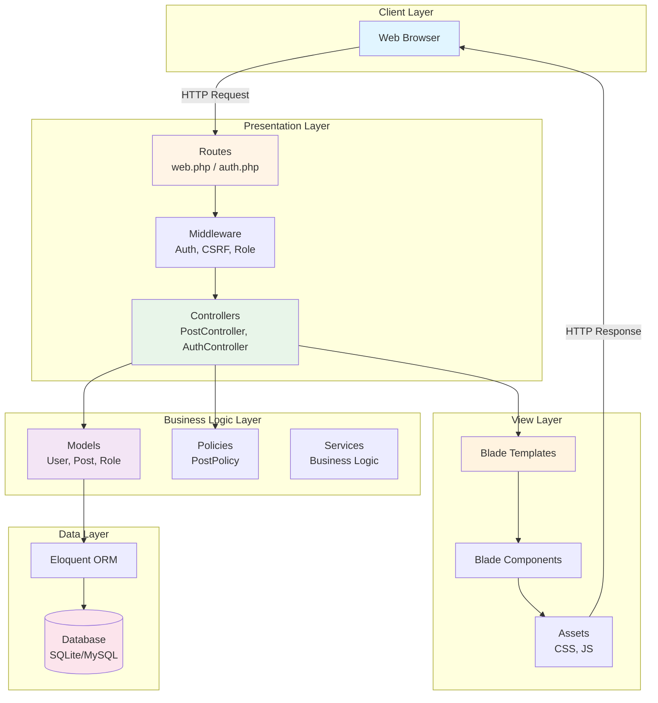
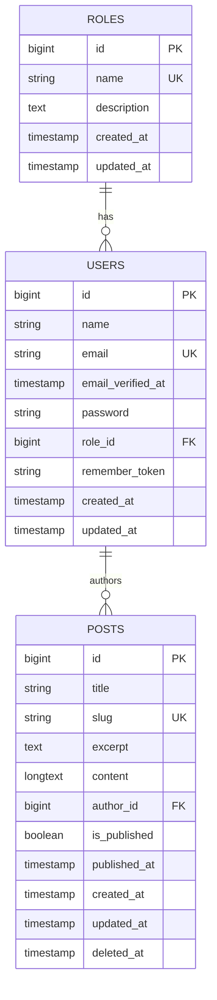
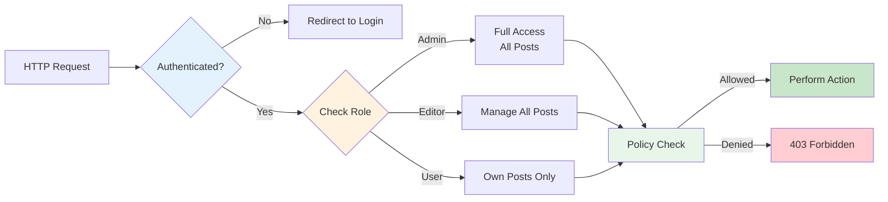
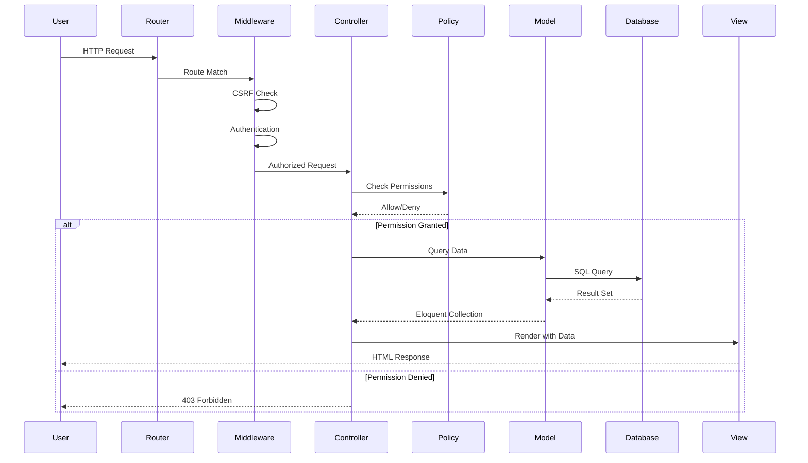

<div align="center">

# 🚀 Laravel User Auth Blog

[](https://laravel.com)
[](https://php.net)
[](https://tailwindcss.com)
[](LICENSE)

**A modern, full-featured blog application built with Laravel 10 showcasing authentication, role-based access control (RBAC), and clean MVC architecture**

[Features](#-features) • [Architecture](#-architecture) • [Installation](#-installation) • [Usage](#-usage) • [Testing](#-testing) • [Documentation](docs/)

---

## 📚 Documentation

- 📖 [Setup Guide](docs/SETUP_GUIDE.md) - Installation instructions for Windows
- 🔌 [API Documentation](docs/API.md) - Routes and endpoints reference
- 🗄️ [Database Schema](docs/DATABASE.md) - Database structure and relationships
- 💻 [Development Guide](docs/DEVELOPMENT.md) - Commands and workflows
- 📋 [Project Summary](docs/PROJECT_SUMMARY.md) - Complete feature checklist
- 📝 [Changelog](CHANGELOG.md) - Version history and changes
- 🤝 [Contributing](CONTRIBUTING.md) - Contribution guidelines

</div>

---

## 📋 Table of Contents

- [About](#-about-the-project)
- [Features](#-features)
- [Tech Stack](#-tech-stack)
- [Architecture](#-architecture)
- [Installation](#-installation)
- [Usage](#-usage)
- [Testing](#-testing)
- [Project Structure](#-project-structure)
- [Contributing](#-contributing)
- [License](#-license)

---

## 🎯 About The Project

This project is a **learning-focused implementation** of a modern blog platform that demonstrates Laravel's best practices and conventions. It showcases:

- **MVC Architecture**: Clean separation of concerns following Laravel conventions
- **Authentication System**: Full-featured auth with Laravel's built-in system
- **Role-Based Access Control (RBAC)**: Three-tier permission system (Admin, Editor, User)
- **Eloquent ORM**: Powerful database relationships and query scopes
- **Policy-Based Authorization**: Fine-grained permission control
- **Blade Templating**: Server-side rendering with reusable components
- **Modern Frontend**: Tailwind CSS with Alpine.js for interactivity

### Why This Project?

This repository serves as a comprehensive example of:
- Laravel's "convention over configuration" philosophy
- Real-world application architecture patterns
- Best practices for authentication and authorization
- Clean code principles in PHP development
- Test-driven development with PHPUnit

---

## ✨ Features

### 🔐 Authentication & Authorization

- **User Registration & Login** with email verification support
- **Password Reset** functionality
- **Remember Me** option for persistent sessions
- **Role-Based Access Control** (RBAC) with three roles:
  - 👑 **Admin**: Full system access, can manage all posts and users
  - ✍️ **Editor**: Can create and manage all posts
  - 👤 **User**: Can create and manage own posts only

### 📝 Blog Management

- **Create, Read, Update, Delete (CRUD)** posts
- **Draft & Publish** workflow
- **Auto-generated slugs** for SEO-friendly URLs
- **Auto-generated excerpts** from content
- **Rich post metadata**: author, timestamps, status
- **Soft deletes** for post recovery
- **Pagination** for post listings

### 🎨 User Interface

- **Responsive Design** with Tailwind CSS
- **Dark mode ready** color scheme
- **Intuitive Dashboard** with statistics
- **Public Blog View** for published posts
- **Profile Management** for users

### 🛡️ Security

- **CSRF Protection** on all forms
- **SQL Injection Prevention** via Eloquent ORM
- **XSS Protection** with Blade escaping
- **Rate Limiting** on authentication
- **Password Hashing** with bcrypt
- **Policy-Based Authorization** for fine-grained control

---

## 🛠️ Tech Stack

<div align="center">

| Category | Technologies |
|----------|-------------|
| **Backend** | PHP 8.1+, Laravel 10.x |
| **Frontend** | Blade Templates, Tailwind CSS 3.x, Alpine.js 3.x |
| **Database** | SQLite (dev), MySQL/PostgreSQL (prod) |
| **Testing** | PHPUnit, Laravel Dusk (optional) |
| **Build Tools** | Vite, NPM |
| **Dev Tools** | Laravel Pint (code style), Laravel Sail (Docker) |

</div>

---

## 🏗️ Architecture

### System Architecture Diagram



### Database Schema



### Role-Based Access Control Flow



### Request Lifecycle



---

## 📦 Installation

### Prerequisites

Before you begin, ensure you have the following installed:

- **PHP 8.1 or higher** ([Download](https://www.php.net/downloads))
- **Composer** ([Download](https://getcomposer.org/download/))
- **Node.js & NPM** ([Download](https://nodejs.org/))
- **SQLite** (or MySQL/PostgreSQL)

### Step-by-Step Installation

#### 1️⃣ Clone the Repository

```bash
git clone https://github.com/AnderssonProgramming/laravel-user-auth-blog.git
cd laravel-user-auth-blog
```

#### 2️⃣ Install PHP Dependencies

```bash
composer install
```

#### 3️⃣ Install JavaScript Dependencies

```bash
npm install
```

#### 4️⃣ Environment Configuration

```bash
# Copy the example environment file
cp .env.example .env

# Generate application key
php artisan key:generate
```

#### 5️⃣ Database Setup

```bash
# Create SQLite database file
touch database/database.sqlite

# Run migrations
php artisan migrate

# Seed database with sample data
php artisan db:seed
```

This will create:
- **3 Roles**: Admin, Editor, User
- **Sample Users**:
  - Admin: `admin@example.com` (password: `password`)
  - Editor: `editor@example.com` (password: `password`)
  - User: `user@example.com` (password: `password`)
- **30 Sample Posts**: Mix of published and draft posts

#### 6️⃣ Build Frontend Assets

```bash
# Development
npm run dev

# Production
npm run build
```

#### 7️⃣ Start Development Server

```bash
php artisan serve
```

Visit [http://localhost:8000](http://localhost:8000) 🎉

---

## 🚀 Usage

### Default Accounts

| Role | Email | Password | Capabilities |
|------|-------|----------|--------------|
| 👑 Admin | admin@example.com | password | Full access to all features |
| ✍️ Editor | editor@example.com | password | Manage all posts |
| 👤 User | user@example.com | password | Manage own posts |

### Common Tasks

#### Creating a New Post

1. Log in to your account
2. Navigate to **Dashboard**
3. Click **"New Post"** button
4. Fill in the form:
   - **Title**: Your post title
   - **Excerpt**: Short description (optional)
   - **Content**: Full post content
   - **Publish**: Check to publish immediately, uncheck for draft
5. Click **"Create Post"**

#### Managing Posts

- **View All Posts**: Visit `/posts` (public)
- **View Dashboard**: Visit `/dashboard` (authenticated)
- **Edit Post**: Click "Edit" on any post you can manage
- **Delete Post**: Click "Delete" (requires confirmation)

#### User Roles

```php
// Check user role in code
if ($user->isAdmin()) {
    // Admin-only code
}

if ($user->isEditor()) {
    // Editor-only code
}

if ($user->hasRole('user')) {
    // User-specific code
}
```

---

## 🧪 Testing

### Running Tests

```bash
# Run all tests
php artisan test

# Run specific test suite
php artisan test --testsuite=Feature

# Run with coverage
php artisan test --coverage
```

### Test Coverage

- ✅ Authentication tests (login, register, logout)
- ✅ Post CRUD operations
- ✅ Authorization policies
- ✅ Role-based access control

### Example Test

```php
public function test_user_can_create_post(): void
{
    $user = User::factory()->create();

    $response = $this->actingAs($user)->post('/posts', [
        'title' => 'Test Post',
        'content' => 'This is test content.',
        'is_published' => false,
    ]);

    $response->assertRedirect();
    $this->assertDatabaseHas('posts', ['title' => 'Test Post']);
}
```

---

## 📁 Project Structure

```
laravel-user-auth-blog/
├── app/
│   ├── Http/
│   │   ├── Controllers/          # Request handlers
│   │   │   ├── Auth/            # Authentication controllers
│   │   │   ├── PostController.php
│   │   │   └── DashboardController.php
│   │   ├── Middleware/          # HTTP middleware
│   │   │   └── CheckRole.php
│   │   └── Requests/            # Form requests
│   ├── Models/                  # Eloquent models
│   │   ├── User.php
│   │   ├── Post.php
│   │   └── Role.php
│   ├── Policies/                # Authorization policies
│   │   └── PostPolicy.php
│   └── Providers/               # Service providers
├── config/                      # Configuration files
├── database/
│   ├── factories/               # Model factories
│   ├── migrations/              # Database migrations
│   └── seeders/                 # Database seeders
├── public/                      # Public assets
├── resources/
│   ├── css/                     # Stylesheets
│   ├── js/                      # JavaScript files
│   └── views/                   # Blade templates
│       ├── auth/                # Authentication views
│       ├── layouts/             # Layout templates
│       ├── posts/               # Post views
│       └── components/          # Reusable components
├── routes/
│   ├── web.php                  # Web routes
│   ├── api.php                  # API routes
│   └── auth.php                 # Authentication routes
├── tests/
│   ├── Feature/                 # Feature tests
│   └── Unit/                    # Unit tests
├── .env.example                 # Environment variables template
├── composer.json                # PHP dependencies
├── package.json                 # JavaScript dependencies
└── README.md                    # This file
```

---

## 🎓 Key Learning Points

### Laravel Concepts Demonstrated

1. **MVC Pattern**
   - Models: Eloquent ORM with relationships
   - Views: Blade templating engine
   - Controllers: Request handling and business logic

2. **Convention Over Configuration**
   - Automatic route model binding
   - Eloquent relationship conventions
   - Migration naming patterns

3. **Authentication & Authorization**
   - Laravel's built-in auth scaffolding
   - Policy-based authorization
   - Middleware for route protection

4. **Database**
   - Migrations for version control
   - Seeders for sample data
   - Factories for testing
   - Relationships (belongsTo, hasMany)

5. **Best Practices**
   - Repository pattern (optional)
   - Service layer separation
   - Form request validation
   - Resource controllers

---

## 🤝 Contributing

Contributions are welcome! This is a learning project, so feel free to:

1. **Fork** the repository
2. **Create** a feature branch (`git checkout -b feature/AmazingFeature`)
3. **Commit** your changes (`git commit -m 'feat: add amazing feature'`)
4. **Push** to the branch (`git push origin feature/AmazingFeature`)
5. **Open** a Pull Request

### Commit Convention

We follow [Conventional Commits](https://www.conventionalcommits.org/):

- `feat:` New feature
- `fix:` Bug fix
- `docs:` Documentation changes
- `style:` Code style changes (formatting, etc.)
- `refactor:` Code refactoring
- `test:` Adding or updating tests
- `chore:` Maintenance tasks

---

## 📄 License

This project is licensed under the **MIT License** - see the [LICENSE](LICENSE) file for details.

---

## 🙏 Acknowledgments

- [Laravel](https://laravel.com) - The PHP Framework
- [Tailwind CSS](https://tailwindcss.com) - Utility-first CSS framework
- [Alpine.js](https://alpinejs.dev) - Lightweight JavaScript framework
- [Heroicons](https://heroicons.com) - Beautiful SVG icons

---

## 📞 Contact

**Anderson Programming**

- GitHub: [@AnderssonProgramming](https://github.com/AnderssonProgramming)
- Project Link: [https://github.com/AnderssonProgramming/laravel-user-auth-blog](https://github.com/AnderssonProgramming/laravel-user-auth-blog)

---

<div align="center">

**⭐ Star this repository if you find it helpful! ⭐**

Made with ❤️ and ☕ by Andersson

</div>